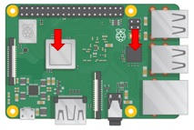

# RetroPie

Detailed instructions on getting RetroPie installed and running on your Raspberry Pi. This guide will be using the [Raspberry Pi 3B+](https://www.raspberrypi.org/products/raspberry-pi-3-model-b-plus/) and a [Kintaro Super Kuma 9000 case](https://www.kintaro.co/products/super-kuma-9000). This guide was made in August 2018.

## Hardware

* Raspberry Pi 3B+
* Micro SD Card 8GB or higher
* 2.5A Micro USB Power Supply
* Kintaro Super Kuma 9000 case
* Nintendo Wii U Pro Controller
* HDMI Cable
* Ethernet Cable

 *Note: The Super Kuma 9000 case has an updated case for the Raspberry Pi 3B+ that comes with a modified heat sink. Make sure you get the right case for your Raspberry Pi or your heat sink will not fit.*

 *Note: [CanaKit](https://www.canakit.com/) sells starter kits that include most of the hardware needed for any Raspberry Pi project.*

## Getting Started

### Parts Assembly

The Super Kuma 9000 case comes with the following:

 * Case
 * Bag of 2 Small Screws
 * Bag of 4 Small Screws
 * Bag of 2 Large Screws
 * Heat Sink
 * Thermal Paste

1. Place Raspberry Pi in bottom of case. Be Sure to align the Screw holes to that of the case.

2. Place a small amount of thermal paste on both the network chip and processor.

 

3. Place heat sink onto the Raspberry Pi. Use the 2 large screws to secure the heat sink to the Raspberry Pi. Place the two screws into the holes closest to the front of the case.

 *Note: Do not over tighten the screws or you could damage your Raspberry Pi. Screws should be tight enough that the heat sink does not move.*

4. Top of case should fit snug. Do not force the case closed. Use the 4 small screws to secure the case from the bottom.

 *Note: This case also supports a 5V 25mm x 25mm x 10mm fan. The heat sink included in the build is enough to keep the Raspberry Pi cool with no over-clocking. The two left over screws are for the optional fan.*

 *Note: For a more detailed walk through including installation instructions for a fan please view this [video](https://youtu.be/3ya1WXlQFK8).*

### Software install

1. Download the latest image from RetroPie. ([click here](http://retropie.org.uk))

2. Write the image to your micro SD card. To do this i used the program Etcher. ([click here](http://etcher.io))

 *Note: Double check which drive you are installing the image to. If you select the wrong drive this will delete any data on that drive.*

 *Note: While you are updating your micro SD with the latest RetroPie image, your computer may prompt you to reformat your micro SD card. Do not allow this.*

3. Install your flash drive into the Raspberry Pi and connect the ethernet, HDMI, and power cables.

## RetroPie Configuration

1. When RetroPie Boots up for the first time it will prompt you to configure your controller. With your controller or keyboard connected select your hotkeys.

 *Note: If using a keyboard remember which keys you select for the D-pad, "A", and "B". they will be needed to navigate the RetroPie menus until you configure your controller.*

2. Navigate the RetroPie menu to RetroPie Setup. Select Update and then select yes to update all. This update can take up to 30 minutes.

3. Once the updates have been installed, select Reboot from the same menu and reboot your RetroPie.
